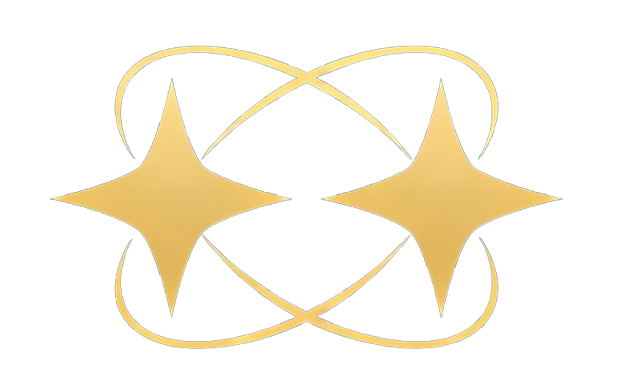
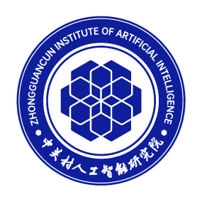

<h1>
    TwinBrainVLA
    
    : Unleashing the Potential of Generalist VLMs for Embodied Tasks via Asymmetric Mixture-of-Transformers
</h1>

**Bin Yu**1,2, **Shijie Lian**2,4, **Xiaopeng Lin**2,5, **Yuliang Wei**1, **Zhaolong Shen**2,6, 
**Changti Wu**2,7, **Yuzhuo Miao**1,2, **Xinming Wang**2,8, **Bailing Wang**1, **Cong Huang**2,3, **Kai Chen**2,3,9

1HIT, 2ZGCA, 3ZGCI, 4HUST, 5HKUST(GZ), 6BUAA, 7ECNU, 8CASIA, 9DeepCybo

[Zhongguancun Academy](https://www.bjzgca.edu.cn/) & [Zhongguancun Institute of Artificial Intelligence](https://www.zgci.ac.cn/)

---

## 📖 Abstract

Standard Vision-Language-Action (VLA) models typically fine-tune a monolithic Vision-Language Model (VLM) backbone explicitly for robotic control. However, this approach creates a critical tension between maintaining high-level general semantic understanding and learning low-level, fine-grained sensorimotor skills, often leading to "*catastrophic forgetting*" of the model's open-world capabilities. 

To resolve this conflict, we introduce **TwinBrainVLA**, a novel architecture that coordinates a generalist VLM retaining universal semantic understanding and a specialist VLM dedicated to embodied proprioception for joint robotic control. TwinBrainVLA synergizes a frozen "Left Brain", which retains robust general visual reasoning, with a trainable "Right Brain", specialized for embodied perception, via a novel **Asymmetric Mixture-of-Transformers (AsyMoT)** mechanism. This design allows the Right Brain to dynamically query semantic knowledge from the frozen Left Brain and fuse it with proprioceptive states, providing rich conditioning for a Flow-Matching Action Expert to generate precise continuous controls.

Extensive experiments on SimplerEnv and RoboCasa benchmarks demonstrate that TwinBrainVLA achieves superior manipulation performance compared to state-of-the-art baselines while explicitly preserving the comprehensive visual understanding capabilities of the pre-trained VLM, offering a promising direction for building general-purpose robots that simultaneously achieve high-level semantic understanding and low-level physical dexterity.

## 🏗️ Architecture

TwinBrainVLA mimics the biological principle of hemispheric lateralization:

  

- **Left Brain (Generalist):** A frozen, pre-trained VLM (e.g., Qwen-VL) that serves as a semantic anchor, preserving open-world knowledge.
- **Right Brain (Specialist):** A trainable VLM initialized with the same weights, specialized for embodied control and proprioceptive state encoding.
- **Asymmetric MoT (AsyMoT):** A mechanism where the Right Brain attends to the frozen Key-Value (KV) pairs of the Left Brain via causal self-attention, transferring semantic knowledge without parameter pollution.
- **Action Expert:** A Flow-Matching Diffusion Transformer (DiT) that generates continuous actions based on the condition features from the Right Brain.

## 🙏 Acknowledgements

We would like to thank the [starVLA](https://github.com/starVLA/starVLA) project for its inspiring work and open-source contributions.
